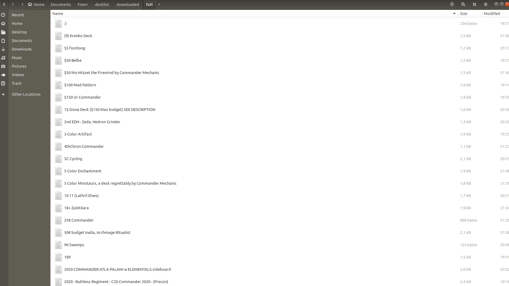

## Description
This project ```deckstats_scraper``` used to collect deck information from the website

## Table of Contents (Optional)

- [Installation](#installation)
- [Usage](#usage)
- [Credits](#credits)
- [License](#license)

## Installation

Install the required libraries from the requirements.txt file with the following command:
```
pip install -r requirements.txt
```

## Usage
Create an `.env` file from the `.env.example` file and change the content accordingly:
- FILES_STORE: Configure the location to store downloaded files (note the change to suit your personal computer)

**The application scans between FROM_TIME and TO_TIME. Note to change the information LOGIN_USERNAME and LOGIN_PASSWORD**. To run the application, run the following command:
```
python main.py
```


## Credits
Contact me if you need more support information
[tony_bidget](https://www.fiverr.com/tony_bidget?up_rollout=true)

## License
No license

---

🏆 The previous sections are the bare minimum, and your project will ultimately determine the content of this document. You might also want to consider adding the following sections.

## Badges


Badges aren't necessary, per se, but they demonstrate street cred. Badges let other developers know that you know what you're doing. Check out the badges hosted by [shields.io](https://shields.io/). You may not understand what they all represent now, but you will in time.

## Features

Your project has a lot of features:
- Collect information on each card from the website https://deckstats.net/decks/search/?search_tags=Commander&lng=en&page=1
- Each card is saved as a file as a text
- The storage location of the image file is located in the settings.py file

## How to Contribute
No contributor

## Tests
No write unite-test